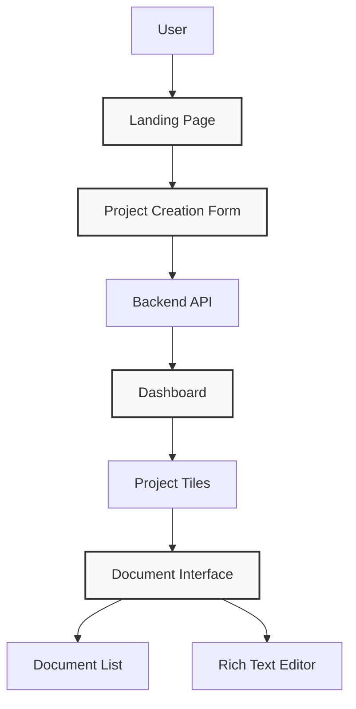

# Frontend Technical Documentation

## Project Overview

This document outlines the frontend requirements for a web application that allows users to:
1. Input project ideas
2. Generate technical documentation through LLM integration
3. View and manage projects through an organized dashboard
4. View and edit technical documents in a rich text editor

## Architecture Diagram



## Page Structure

### 1. Landing Page
- **Purpose**: Introduce the application and guide users to project creation
- **Components**:
  - Navigation bar with logo, login/signup, and dashboard link
  - Hero section explaining the application's purpose
  - CTA button to create a new project
  - Features/benefits section
  - Footer with links and information

### 2. Project Creation Page
- **Purpose**: Capture project idea and requirements from user
- **Components**:
  - Form with text input fields for:
    - Project name
    - Project description
    - Project requirements (could be multiple fields or tags)
    - Technology preferences (optional)
  - Submission button
  - Loading state indicator during generation
  - Success/failure feedback

### 3. Dashboard Page
- **Purpose**: Overview of all user projects
- **Components**:
  - Navigation bar with user profile and actions
  - Project tiles with:
    - Project name
    - Creation date
    - Brief description/summary
    - Status indicator
    - Thumbnail or icon
  - "Create New Project" tile/button
  - Filtering and sorting options
  - Pagination if many projects exist

### 4. Document Interface Page
- **Purpose**: View and edit documents for a specific project
- **Components**:
  - Left sidebar (25% width):
    - Document list with categories
    - Document titles
    - Creation/modification dates
    - Tags or metadata
  - Main content area (75% width):
    - Rich text editor with formatting tools
    - Save/autosave functionality
    - Version history
    - Sharing options
  - Project header with:
    - Project name
    - Navigation breadcrumbs
    - Action buttons (export, settings, etc.)

## Component Specifications

### Navigation Bar
- Consistent across all pages
- Responsive design that collapses to hamburger menu on mobile
- User account dropdown menu
- Notification system (optional)

### Project Tiles
- Grid layout with responsive sizing
- Hover effects for better user feedback
- Card-based design with consistent styling
- Limited preview of project information

### Document List
- Hierarchical structure with collapsible sections
- Clear visual indicators for active document
- Search functionality for documents
- Drag-and-drop reordering (optional)

### Rich Text Editor
- Full-featured editor with formatting tools:
  - Text styling (bold, italic, underline)
  - Headers and paragraph formatting
  - Lists (ordered and unordered)
  - Code blocks with syntax highlighting
  - Tables
  - Image insertion
- Real-time collaboration capabilities (optional)
- Comment/annotation system (optional)

## UI Mockups

### Dashboard Layout

```
+--------------------------------------------------------------+
|                        NAVIGATION BAR                        |
+--------------------------------------------------------------+
|                                                              |
|  +----------+  +----------+  +----------+  +----------+      |
|  | Project 1 |  | Project 2 |  | Project 3 |  | New      |   |
|  |          |  |          |  |          |  | Project   |   |
|  |          |  |          |  |          |  |          |   |
|  +----------+  +----------+  +----------+  +----------+      |
|                                                              |
|  +----------+  +----------+  +----------+                    |
|  | Project 4 |  | Project 5 |  | Project 6 |                 |
|  |          |  |          |  |          |                 |
|  |          |  |          |  |          |                 |
|  +----------+  +----------+  +----------+                    |
|                                                              |
+--------------------------------------------------------------+
```

### Document Interface Layout

```
+--------------------------------------------------------------+
|                        NAVIGATION BAR                        |
+--------------------------------------------------------------+
| PROJECT NAME                            |  ACTIONS           |
+-------------------------+------------------------------+------+
|                         |                                    |
| Document List (25%)     |       Rich Text Editor (75%)      |
| +-----------------+     |                                    |
| | - Doc Category  |     |  +--------------------------------+|
| |   - Doc 1       |     |  |                                ||
| |   - Doc 2       |     |  |                                ||
| | - Doc Category  |     |  |                                ||
| |   - Doc 3       |     |  |                                ||
| |   - Doc 4       |     |  |                                ||
| | - Doc Category  |     |  |                                ||
| |   - Doc 5       |     |  |                                ||
| |   - Doc 6       |     |  |                                ||
| |                 |     |  |                                ||
| |                 |     |  |                                ||
| |                 |     |  |                                ||
| +-----------------+     |  +--------------------------------+|
|                         |                                    |
+-------------------------+------------------------------------+
```

## User Experience Considerations

### Responsive Design
- The application should function well on devices from mobile phones to large desktop screens
- Implement appropriate breakpoints for different device sizes
- Consider touch interfaces for mobile users

### Accessibility
- Ensure WCAG 2.1 AA compliance
- Provide appropriate contrast ratios
- Include proper ARIA labels
- Ensure keyboard navigation works properly

### Performance
- Implement code splitting to reduce initial load time
- Optimize images and assets
- Consider lazy loading for components not immediately visible
- Add appropriate loading states and skeleton screens

## Animation and Transitions

### Micro-interactions
- Subtle animations for button hover/click states
- Smooth transitions between pages and states
- Loading indicators that provide feedback on progress

### Document Interface
- Smooth scrolling in document list
- Transition effects when switching between documents
- Animations for expanding/collapsing document categories

## Implementation Priorities

### Phase 1 (MVP)
1. Landing page with basic information
2. Project creation form
3. Simple dashboard with project tiles
4. Basic document interface with minimal text editing

### Phase 2 (Enhanced Features)
1. Advanced rich text editing capabilities
2. Document organization and categorization
3. User preferences and customization
4. Improved dashboard with filtering and sorting

### Phase 3 (Advanced Features)
1. Collaborative editing
2. Document version history
3. Advanced export options
4. Integration with third-party tools

## Testing Strategy

### Component Testing
- Unit tests for individual components
- Integration tests for component interactions
- Snapshot testing for UI consistency

### User Testing
- Usability testing with representative users
- A/B testing for key interactions
- Feedback collection mechanisms

## Conclusion

This technical specification outlines the frontend requirements for creating a project management web application focused on document generation and management. The implementation should prioritize user experience, performance, and maintainability while providing a robust platform for future enhancements.