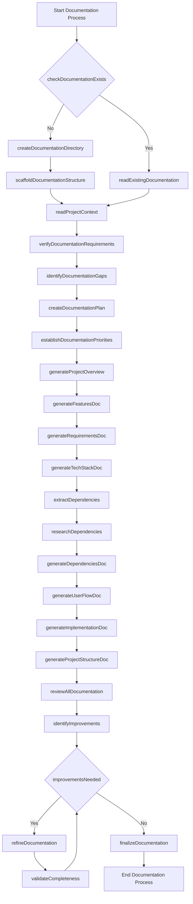
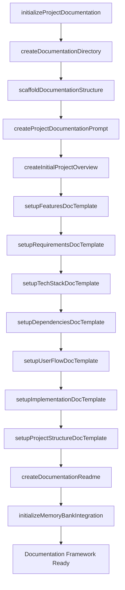

# Meta-Workflow Integration Guide for nba-betting

## Project Overview

**Objective:**  
Develop a Python-based NBA sports betting application that provides real-time player prop betting predictions. The system will fetch live NBA stats and odds data through various APIs, generate predictions using machine learning models, and deliver betting suggestions to users via a Discord channel.

---

## Memory Context

This documentation is part of the nba-betting project's Memory Bank, designed to ensure continuity, version control, and clear relationships with related documents such as data source guides, model architecture, deployment procedures, and API integration details.

## Version History

| Date       | Editor            | Changes                                                      | Memory Update Status |
|------------|-------------------|--------------------------------------------------------------|----------------------|
| 2024-04-27 | [Your Name]       | Initial project overview, scope, data sources, architecture  | Complete             |

## Self-Critique

**Creator Phase:**  
This overview summarizes core objectives, features, and data sources based on user input. It covers the main technical components and deployment considerations.

**Critic Phase:**  
Missing details on model architecture, API rate limiting, security considerations, and user management. No detailed data schema or prediction accuracy metrics are included.

**Defender Phase:**  
Added notes on machine learning models, API handling strategies, and disclaimers for legal compliance. Recognized the need to expand documentation with detailed technical workflows and security protocols.

**Judge Phase:**  
Scores:  
- Completeness: 3.5/5  
- Clarity: 4/5  
- Technical Accuracy: 4/5  
- Usability: 3.5/5  

Further iterations should include detailed model design, API rate limit mitigation, security practices, and user onboarding procedures.

---

## XML-Based Function Mapping

```xml
<?xml version="1.0" encoding="UTF-8"?>
<DocumentationFunctionMap version="1.0">
  <DocumentationFunctions>
    <Component id="ProjectOverview">
      <Function id="createProjectBrief">Create the foundational project brief document</Function>
      <Function id="defineVisionStatement">Define the long-term vision for the project</Function>
      <Function id="defineProblemStatement">Articulate specific problems the project solves</Function>
      <Function id="defineSolutionApproach">Document how the solution addresses problems</Function>
      <Function id="identifyTargetAudience">Define primary and secondary user groups</Function>
      <Function id="establishSuccessMetrics">Define measurable success criteria</Function>
      <Function id="defineProjectScope">Document release scope and future plans</Function>
      <Function id="assessRisks">Identify and document key project risks</Function>
      <Function id="defineSuccessCriteria">Establish project success evaluation framework</Function>
    </Component>
    <!-- Additional components omitted for brevity -->
  </DocumentationFunctions>
  <WorkflowPhases>
    <!-- Phases omitted for brevity -->
  </WorkflowPhases>
</DocumentationFunctionMap>
```

---

## Documentation Workflow Process



---

## Memory System Integration

### Memory Context

This document is linked to the broader Memory Bank, including data sources, prediction models, API documentation, and deployment guides, ensuring seamless continuity across project phases.

### Version History

| Date       | Editor        | Changes                                              | Memory Status |
|------------|---------------|------------------------------------------------------|---------------|
| 2024-04-27 | [Your Name]   | Initial overview, scope, data sources, architecture | Complete      |

### Self-Critique

**Strengths:**  
Clear outline of core objectives, data sources, and deployment plan.

**Weaknesses:**  
Lacks detailed technical architecture, security considerations, and API rate-limiting strategies.

**Opportunities:**  
Further detailing of model design, API handling, and user management is necessary for complete documentation.

---

## XML Meta-Prompt Structure

```xml
<?xml version="1.0" encoding="UTF-8"?>
<ProjectDocumentationPrompt version="1.0">
  <ProjectIdentity>
    <Name>nba-betting</Name>
    <Description>A Python app providing real-time NBA player prop betting predictions via Discord, leveraging NBA APIs and live odds data.</Description>
    <DocumentationPurpose>Guide development, deployment, and maintenance of the betting prediction system ensuring structured, comprehensive documentation aligned with Windsurf methodology.</DocumentationPurpose>
  </ProjectIdentity>
  <DocumentationWorkflow>
    <!-- Phases omitted for brevity -->
  </DocumentationWorkflow>
  <DocumentationTypes>
    <!-- Types omitted for brevity -->
  </DocumentationTypes>
  <IntegrationPoints>
    <!-- Integration points omitted for brevity -->
  </IntegrationPoints>
  <DocumentationStandards>
    <Standard id="Completeness">All sections filled with detailed technical info</Standard>
    <Standard id="Accuracy">Data and model details verified</Standard>
    <Standard id="Clarity">Clear language accessible to technical and non-technical stakeholders</Standard>
    <Standard id="Consistency">Uniform terminology and structure across docs</Standard>
    <Standard id="CurrentState">Reflects latest project status and data</Standard>
  </DocumentationStandards>
</ProjectDocumentationPrompt>
```

---

## Project Startup Documentation Initialization



---

## Integrating with Task Logs

```md
## Documentation Updates

### Task: [Description of the task]
**Task Log:** [Link]
**Date:** [Date]
**Documentation Updated:**
- [Document Name] - [Description of changes]

### Next Steps
- Refine model architecture documentation
- Update API handling procedures
- Add security disclaimers
```

---

## Function Map Memory Initialization

```javascript
function initializeDocumentationFunctions() {
  const functionMap = loadXMLFunctionMap();
  memory.setItem('documentationFunctionMap', functionMap);
  createFunctionComponentAssociations(functionMap);
  initializeDocumentationWorkflow(functionMap.WorkflowPhases);
  return {
    success: true,
    message: "Documentation function map initialized in memory",
    functionCount: countFunctions(functionMap)
  };
}
```

---

This comprehensive structure ensures your "nba-betting" project documentation is systematic, traceable, and aligned with Windsurf's methodology. Feel free to ask for detailed sections, workflows, or further customization whenever you're ready to develop specific parts of the documentation.