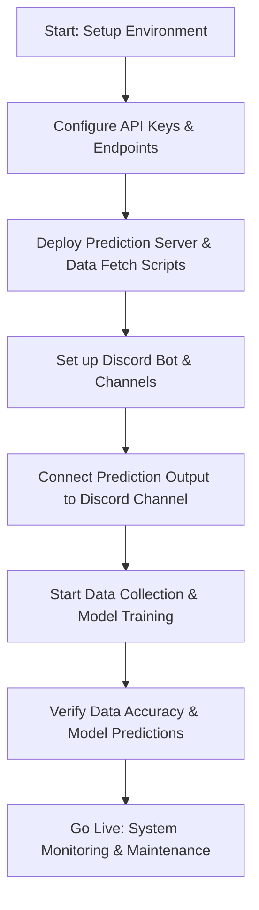
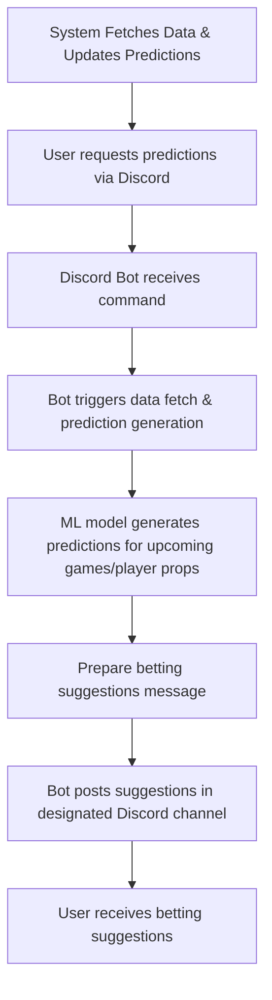

# User Flow Documentation for "nba-betting"

## Overview

This User Flows document describes the typical pathways a user or system component follows to interact with the "nba-betting" application, from initial setup to receiving betting predictions via Discord. It details core user journeys, primary feature interactions, error handling, and platform-specific behaviors to ensure clarity and smooth operation.

## Memory Context

This document is part of the "nba-betting" project memory bank, linked with data sources (NBA APIs, odds providers), prediction models, deployment infrastructure, and user interaction modules. It informs user interface design, API integrations, and operational workflows.

## Version History

| Date       | Editor        | Changes                                                      | Memory Update Status |
|------------|---------------|--------------------------------------------------------------|----------------------|
| 2024-04-27 | [Your Name]   | Initial creation of user flow pathways for prediction delivery | Complete             |

---

## User Flows

### 1. Initial User Journey: Setting Up the System (Developer/Administrator)



*Note:* This pathway is primarily for initial setup, not end-user interaction.

---

### 2. Daily Prediction Delivery Workflow (User Interaction)



**Notes:**
- The system runs automated scheduled fetches and predictions, but users can also trigger predictions with commands.
- Predictions include player props, odds, and confidence levels.

---

### 3. User Interaction: Requesting Predictions Manually

```mermaid
graph TD
  A[User types command "!predict" in Discord] --> B[Discord Bot detects command]
  B --> C[Bot fetches latest data & runs prediction models]
  C --> D[Bot compiles prediction summary]
  D --> E[Bot posts prediction results and suggestions]
  E --> F[User reads suggestions and decides to bet]
```

*Note:* This flow applies when users manually request predictions.

---

### 4. Error Handling and Support Flows

```mermaid
flowchart TD
  A[User requests prediction] -->|Successful| B[Prediction generated and posted]
  A -->|Failure (e.g., API error or data issue)| C[Bot detects error]
  C --> D[Bot posts error message: "Data unavailable, please try again later."]
  D --> E[User retries or waits]
  
  subgraph System Failures
    F[API rate limit exceeded or data fetch timeout] --> G[Bot logs error]
    G --> H[Alert admin / system monitor]
  end
```

*Note:* Clear error messages and fallback procedures ensure user trust and system stability.

---

### 5. Platform-Specific Flows: Discord Integration

```mermaid
flowchart TD
  A[User joins Discord server] --> B[Bot joins server and joins prediction channel]
  B --> C[User types command "!predict"]
  C --> D[Bot fetches data, runs models]
  D --> E[Bot sends message with betting suggestions]
  E --> F[User reads and interacts]
```

*Optional Future Path:* Extending to web or mobile interface would follow similar flows adapted for those platforms.

---

## Summary of Main Flows

| Pathway                            | Description                                              | Responsible Entity            |
|------------------------------------|----------------------------------------------------------|------------------------------|
| System Initialization              | Setting up environment, APIs, server, and Discord bot   | Developer / Admin            |
| Daily Prediction Cycle             | Data fetch → Model prediction → Discord message delivery | System / Automated Process   |
| User-Triggered Prediction           | User command "!predict" → Data fetch → Output message   | User / Discord Bot           |
| Error Handling                     | Detect errors → Inform users / Log errors               | System / Discord Bot         |
| Platform-Specific Interaction      | User joins, commands, and receives messages             | User / Discord Client        |

---

## Next Steps

- Implement detailed diagrams for each flow
- Document error scenarios and recovery steps
- Develop wireframes or mockups for user commands and messages
- Integrate user feedback pathways for improving prediction usefulness

---

## Self-Critique

**Strengths:**  
- Clear pathways for normal operation and error handling  
- Focused on seamless user experience via Discord commands  
- Supports future expansion to other platforms

**Challenges:**  
- Ensuring real-time data consistency and timely predictions  
- Handling API limits and data latency  
- Providing user-friendly messaging for complex predictions

**Opportunities for Improvement:**  
- Incorporate user feedback loops to refine prediction clarity  
- Add onboarding flows or help commands for new users  
- Plan for mobile or web interface integration in future iterations

---

This user flow documentation aligns with the Windsurf methodology, ensuring clarity, traceability, and usability for both developers and users of the "nba-betting" platform.