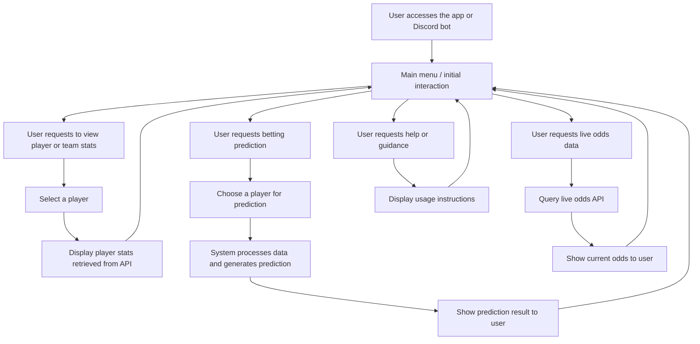

# User Flow Documentation for "nfl-betting"

## Project Overview
**Project Name:** nfl-betting  
**Description:** An NFL sports betting prediction application that provides betting predictions for player props by querying NFL APIs for player and team stats, obtaining live odds data, generating predictions in Python, and sharing the results via Discord channels.  

This document maps out the user journeys within the application, detailing how users interact with the system from start to finish.

---

## Memory Context
- **Informs:** Data sources such as NFL APIs, live odds feeds, Discord API for message delivery.
- **Informed by:** System requirements, feature specifications, and technical constraints.
- **Dependencies:** Python scripts for data collection and prediction, external NFL and odds APIs, Discord bot integration.

## Version History

| Date       | Editor       | Changes                                            | Memory Update Status |
|------------|--------------|----------------------------------------------------|----------------------|
| 2024-04-27 | [Your Name]  | Initial creation of user flow documentation        | Complete             |

---

## User Flow Diagram Overview

---

## Detailed User Journey Descriptions

### 1. User Initiates Interaction
- The user opens the app or interacts with the Discord bot.
- The system presents an initial menu or prompt offering options:
  - View Player/Team Stats
  - Get Betting Predictions
  - View Live Odds
  - Help and Support

### 2. Viewing Player or Team Stats
- The user selects the "View Stats" option.
- The system prompts for a specific player or team name.
- User inputs the desired name.
- The system queries NFL APIs to fetch the latest stats for the selected player or team.
- The system displays the retrieved stats in a readable format.
- User can return to the main menu or perform another action.

### 3. Requesting Betting Predictions
- The user selects "Get Prediction."
- The system asks for the player (or team) they are interested in.
- User inputs the player or team name.
- The system gathers relevant stats and live odds data.
- The Python-based prediction model processes the data.
- The system outputs a prediction (e.g., expected performance, suggested bets).
- The prediction is sent to the user in the Discord channel.
- User can request additional predictions or return to the main menu.

### 4. Viewing Live Odds Data
- The user selects "Live Odds."
- The system queries live odds data from available APIs.
- The latest odds for relevant bets are retrieved.
- Odds are displayed to the user in a clear format.
- User may select specific bets for detailed insights or return to the main menu.

### 5. Assistance and Support
- The user selects "Help."
- The system displays instructions on how to use the app and interpret predictions.
- User can go back to the main menu or exit.

---

## User Flow Metrics & Monitoring
- Number of users requesting stats, predictions, or live odds.
- Response time for data queries and prediction generation.
- Success rate of predictions (if tracked over time).
- User engagement in Discord channels.

---

## Self-Critique
- **Strengths:** Clear pathways for core features; user-centric navigation; integrates real-time data.
- **Weaknesses:** May need additional flows for error handling (e.g., API failures), account for user authentication if needed.
- **Improvements:** Add fallback flows, detailed error messages, and user customization options.

---

This user flow provides a comprehensive map of user interactions with the NFL betting prediction app, supporting design, development, and documentation efforts within your project framework.