# User Flows - MCP Technical Documentation Server

**Last Updated:** April 19, 2025  
**Memory Bank Status:** Complete  
**Workflow Phase:** Creation

## Memory Context
- **Informs:** Implementation Standards
- **Informed by:** Project Overview, Feature Specifications, Requirements
- **Dependencies:** None

## Version History
| Date         | Editor | Changes             | Status  |
|--------------|--------|---------------------|---------|
| 04/19/2025   | Cascade | Initial creation    | Complete|

## Core User Journeys

### 1. Document Creation and Management Flow

#### 1.1 Creating a New Document
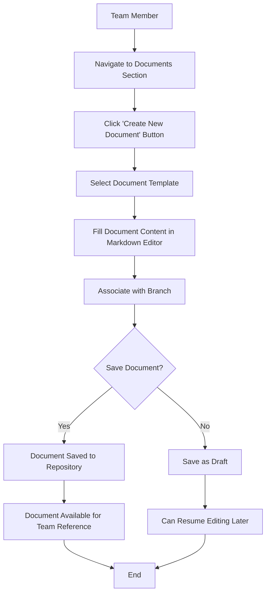

#### 1.2 Updating an Existing Document
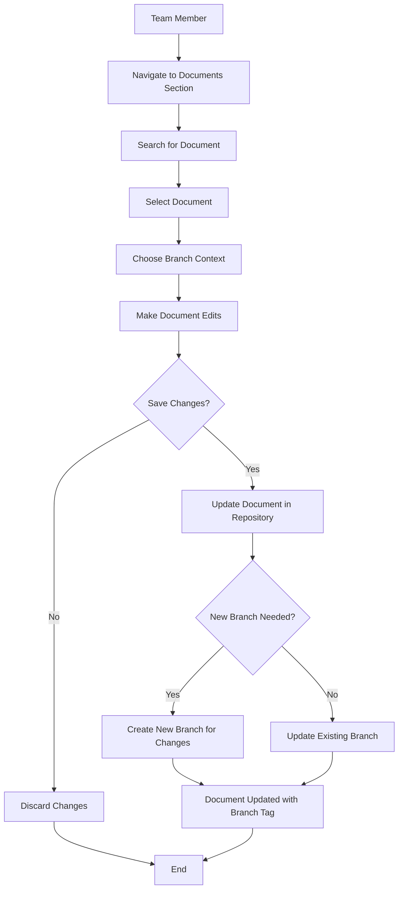

#### 1.3 Document Review and Approval
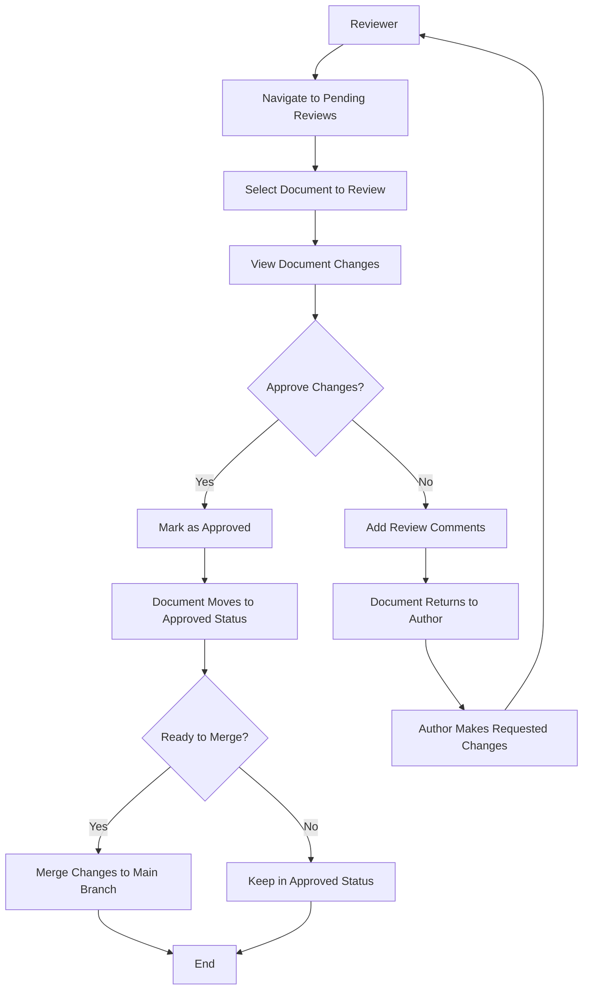

### 2. Branch-Based Workflow

#### 2.1 Creating a New Documentation Branch
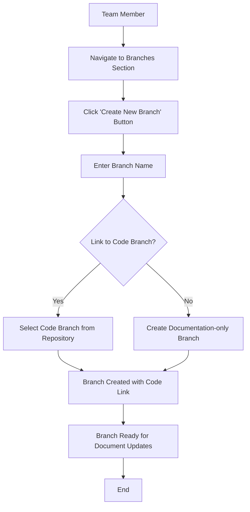

#### 2.2 Merging Documentation Branches
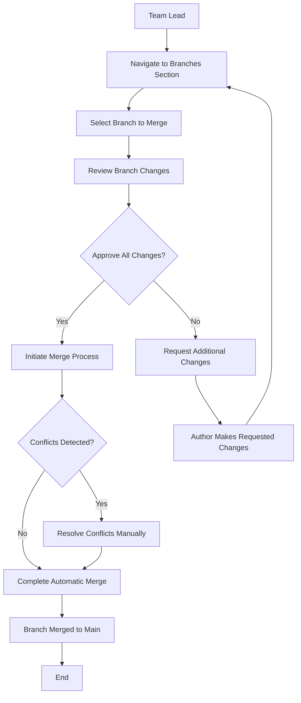

#### 2.3 Synchronizing with Code Branches
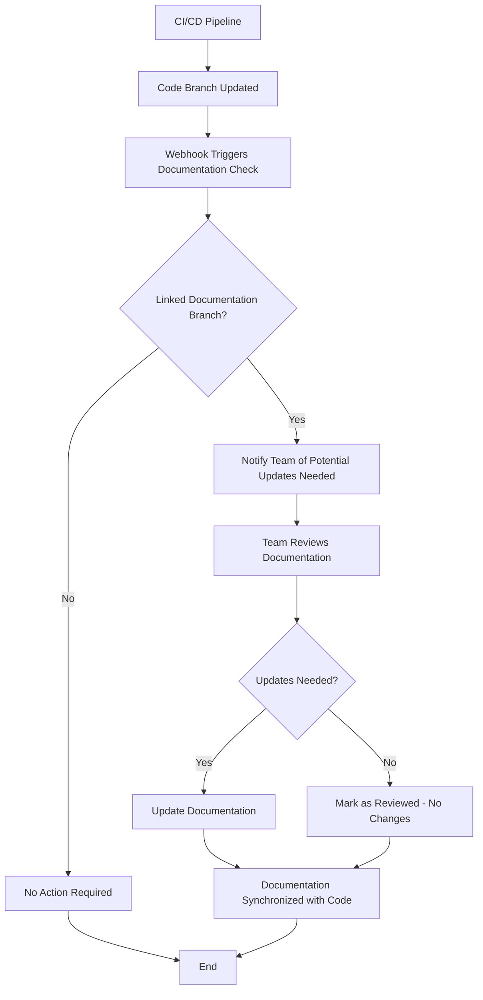

### 3. Documentation Dashboard Usage

#### 3.1 Monitoring Documentation Health
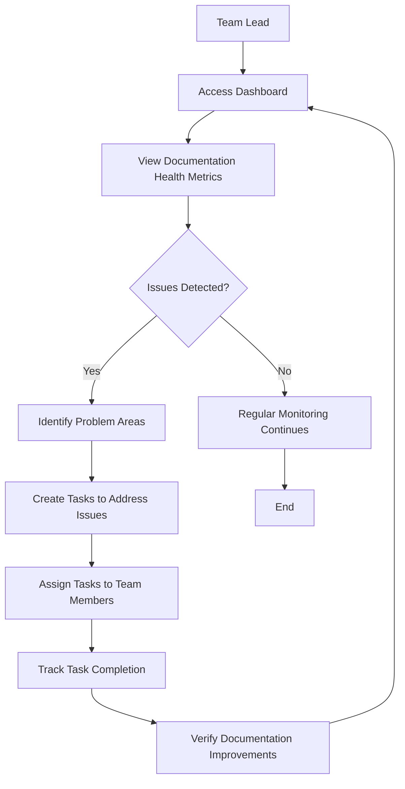

#### 3.2 Using Performance Metrics
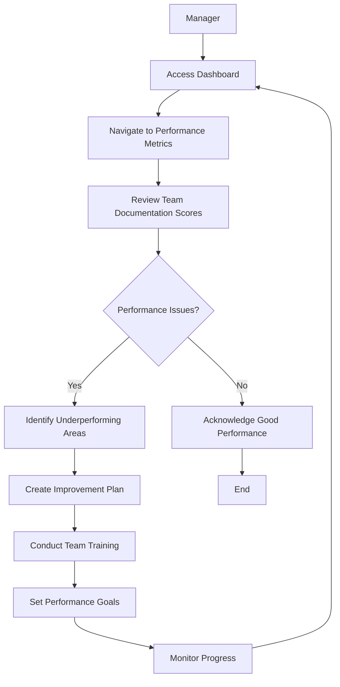

#### 3.3 Searching for Documentation
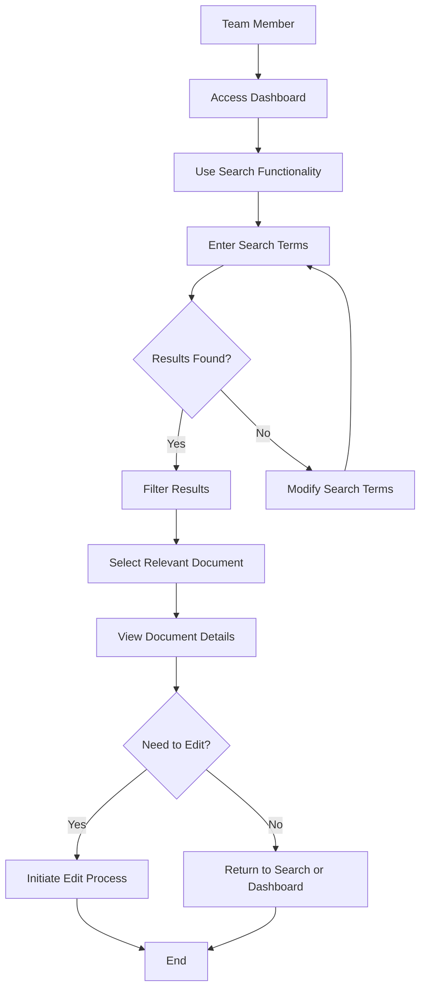

### 4. Windsurf Workflow Integration

#### 4.1 Memory Bank Synchronization
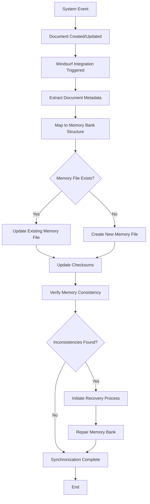

#### 4.2 Task Logging Workflow
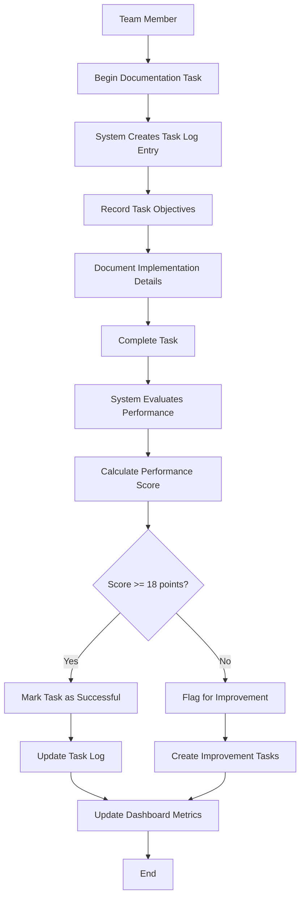

#### 4.3 Event-Driven Documentation Updates
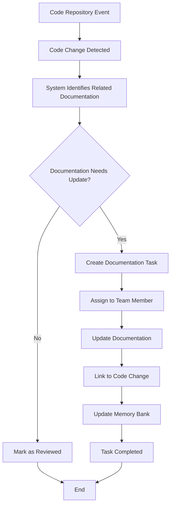

### 5. API and Integration Flows

#### 5.1 External Tool Integration
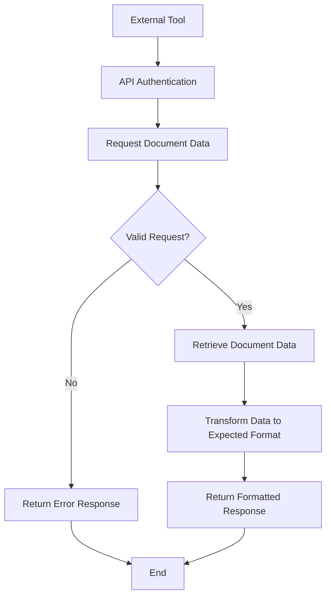

#### 5.2 IDE Plugin Workflow
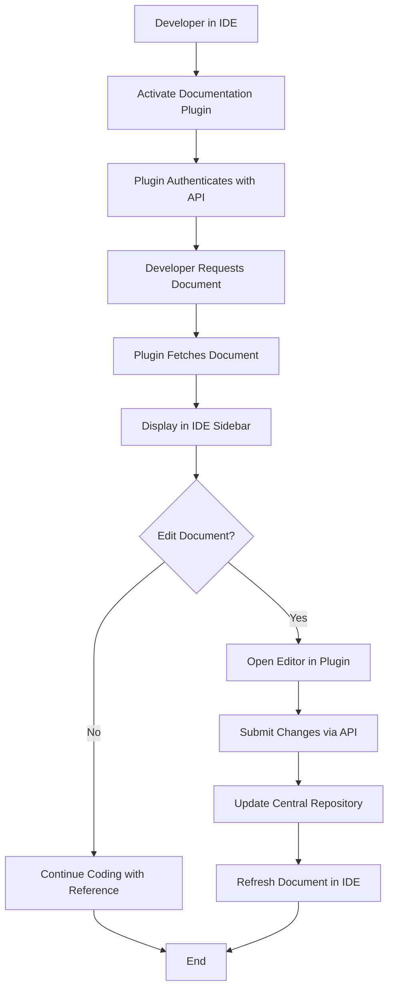

#### 5.3 CI/CD Integration
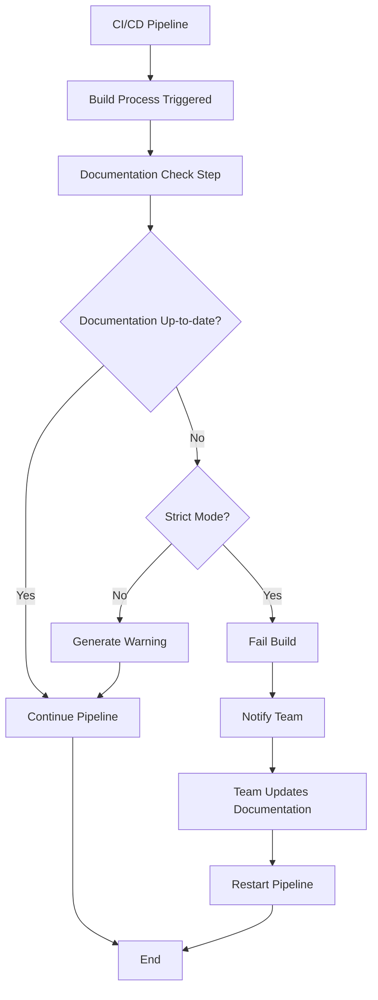

## User Personas and Key Journeys

### Developer Persona
**Name:** Alex  
**Role:** Software Developer  
**Goals:** Find technical documentation quickly, update docs when code changes, keep documentation in sync with branches

**Key Journeys:**
1. Creating/updating documentation tied to code changes
2. Finding relevant technical documentation while coding
3. Using branch-based workflows for documentation
4. Receiving notifications about outdated documentation

### Team Lead Persona
**Name:** Taylor  
**Role:** Engineering Team Lead  
**Goals:** Ensure team documentation is complete and accurate, monitor documentation health, approve documentation changes

**Key Journeys:**
1. Monitoring documentation health via dashboard
2. Reviewing and approving documentation changes
3. Merging documentation branches
4. Setting documentation standards for the team

### New Team Member Persona
**Name:** Jordan  
**Role:** New Developer  
**Goals:** Quickly understand project through documentation, learn the team's documentation patterns, contribute documentation

**Key Journeys:**
1. Searching for documentation to understand the project
2. Learning the documentation templates and standards
3. Creating first documentation contributions
4. Understanding the branch-based workflow

### Project Manager Persona
**Name:** Casey  
**Role:** Project Manager  
**Goals:** Track project progress through documentation, ensure documentation tasks are completed, report on documentation health

**Key Journeys:**
1. Using dashboard to track documentation status
2. Monitoring team performance metrics
3. Identifying documentation gaps
4. Creating tasks for documentation improvements

## Usability Considerations

### Reducing Friction
1. **One-Click Access**: Important documents accessible within 1-2 clicks
2. **Auto-Save**: Prevent data loss during editing
3. **Template Pre-filling**: Templates with smart defaults to reduce input time
4. **Search Prioritization**: Intelligent search that learns user preferences
5. **Contextual Help**: In-context assistance for documentation workflows

### Error Prevention
1. **Validation Feedback**: Immediate validation for document format/content
2. **Conflict Detection**: Early warning for potential merge conflicts
3. **Template Enforcement**: Guard rails to ensure standard compliance
4. **Permission Checks**: Clear indicators of user permissions
5. **Unsaved Changes Alerts**: Prevent accidental navigation away from edits

### Accessibility
1. **Keyboard Navigation**: Full functionality without requiring mouse
2. **Screen Reader Support**: ARIA-compliant components
3. **Color Contrast**: High contrast mode available
4. **Text Scaling**: Support for text size adjustment
5. **Focus Management**: Clear focus indicators for keyboard navigation

## Documentation Self-Critique

### Creation Phase
Draft created on 04/19/2025 per `createUserFlows`.

### Self-Evaluation Phase
Checked against Dos/Don'ts (10 points total):
- Dos: Specific? Yes. Justified? Yes. Edge cases? Yes. Self-evaluated? Yes. Examples? Yes. (5/5)
- Don'ts: Avoided vague? Yes. Skipped rationale? No. Ignored readers? No. Overcomplicated? No. Unchecked? No. (5/5)
- **Score**: 10/10

### Review Phase
Scored against 5 criteria (baseline 4/5):
1. Comprehensive user journey coverage - Yes
2. Clear flow visualization - Yes
3. Persona-based considerations - Yes
4. Usability considerations addressed - Yes
5. Error cases and edge paths included - Yes
- **Initial Score**: 5/5

### Outcome
- Pass (5/5)

## Next Steps
1. Create Implementation Standards document
2. Validate user flows with stakeholders
3. Create interactive prototypes for key flows
4. Develop acceptance criteria for each flow
