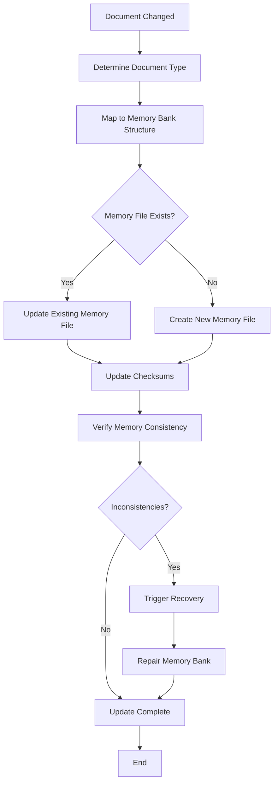

# Meta-Workflow Integration - MCP Technical Documentation Server

**Last Updated:** April 19, 2025  
**Memory Bank Status:** Complete  
**Workflow Phase:** Creation

## Memory Context
- **Informs:** All Windsurf memory bank components
- **Informed by:** All previous documentation
- **Dependencies:** Windsurf workflow system

## Version History
| Date         | Editor | Changes             | Status  |
|--------------|--------|---------------------|---------|
| 04/19/2025   | Cascade | Initial creation    | Complete|

## Documentation Workflow Integration

This document defines how the MCP Technical Documentation Server integrates with the Windsurf memory-based workflow system, ensuring perfect alignment between code, documentation, and the memory bank.

### XML-Based Function Mapping

The following XML structure maps documentation components to specific Windsurf functions:

```xml
<?xml version="1.0" encoding="UTF-8"?>
<DocumentationFunctionMap version="1.0">
  <!-- Documentation Component Functions -->
  <DocumentationFunctions>
    <Component id="ProjectOverview">
      <Function id="createProjectOverview">Define vision, scope, goals, and success criteria</Function>
      <Function id="reviewProjectOverview">Score against 5 criteria (baseline 4/5)</Function>
      <Function id="reviseProjectOverview">Revise based on review feedback; limit 1 retry</Function>
    </Component>
    <Component id="Features">
      <Function id="createFeatureSpecs">Document features and roadmap</Function>
      <Function id="reviewFeatureSpecs">Score against 5 criteria (baseline 4/5)</Function>
      <Function id="reviseFeatureSpecs">Revise based on review feedback; limit 1 retry</Function>
    </Component>
    <Component id="Requirements">
      <Function id="createRequirements">Define functional, technical, and performance requirements</Function>
      <Function id="reviewRequirements">Score against 5 criteria (baseline 4/5)</Function>
      <Function id="reviseRequirements">Revise based on review feedback; limit 1 retry</Function>
    </Component>
    <Component id="TechStack">
      <Function id="createTechStack">Document tech choices for frontend, backend, and infra</Function>
      <Function id="reviewTechStack">Score against 5 criteria (baseline 4/5)</Function>
      <Function id="reviseTechStack">Revise based on review feedback; limit 1 retry</Function>
    </Component>
    <Component id="Dependencies">
      <Function id="createDependencyDocs">Document dependencies with versions and links</Function>
      <Function id="reviewDependencyDocs">Score against 5 criteria (baseline 4/5)</Function>
      <Function id="reviseDependencyDocs">Revise based on review feedback; limit 1 retry</Function>
    </Component>
    <Component id="ProjectStructure">
      <Function id="createProjectStructure">Document file organization and conventions</Function>
      <Function id="reviewProjectStructure">Score against 5 criteria (baseline 4/5)</Function>
      <Function id="reviseProjectStructure">Revise based on review feedback; limit 1 retry</Function>
    </Component>
    <Component id="UserFlow">
      <Function id="createUserFlows">Map user journeys and interactions</Function>
      <Function id="reviewUserFlows">Score against 5 criteria (baseline 4/5)</Function>
      <Function id="reviseUserFlows">Revise based on review feedback; limit 1 retry</Function>
    </Component>
    <Component id="Implementation">
      <Function id="createImplementationStandards">Define code patterns and practices</Function>
      <Function id="reviewImplementationStandards">Score against 5 criteria (baseline 4/5)</Function>
      <Function id="reviseImplementationStandards">Revise based on review feedback; limit 1 retry</Function>
    </Component>
    <Component id="MetaWorkflow">
      <Function id="createMetaWorkflowIntegration">Map documentation workflow integration</Function>
      <Function id="performFinalDocumentationReview">Review all docs holistically</Function>
      <Function id="calculateDocumentationQualityScore">Calculate final quality score</Function>
    </Component>
  </DocumentationFunctions>

  <!-- Workflow Phases -->
  <WorkflowPhases>
    <Phase name="Initialization">
      <Function id="checkDocumentationExists">Check for existing docs</Function>
      <Function id="scaffoldDocumentationStructure" condition="!documentationExists">Create initial files</Function>
    </Phase>
    <Phase name="Creation">
      <Function id="generateDocumentation">Execute creation functions per component</Function>
      <Function id="selfEvaluateDocumentation">Self-check against Dos/Don'ts</Function>
    </Phase>
    <Phase name="Review">
      <Function id="reviewDocumentation">Score each component (baseline 4/5)</Function>
      <Function id="reviseDocumentation" condition="score < 4/5">Revise once per failed component</Function>
    </Phase>
    <Phase name="Finalization">
      <Function id="finalizeDocumentation">Compile approved docs</Function>
      <Function id="updateMemoryBank">Save to memory system</Function>
    </Phase>
  </WorkflowPhases>
</DocumentationFunctionMap>
```

### Windsurf Event Handler Integration

The MCP Technical Documentation Server implements handlers for all Windsurf events:

```xml
<EventHandlers>
  <Handler event="SessionStart">
    <Action>Check if `.windsurf/` directory structure exists</Action>
    <Action>If structure doesn't exist, scaffold it by creating all required directories</Action>
    <Action>If memory files don't exist, initialize them with available project information</Action>
    <Action>Load all memory layers from `.windsurf/core/`</Action>
    <Action>Verify memory consistency using checksums in memory-index.md</Action>
    <Action>Identify current task context from activeContext.md</Action>
    <Action>Load and verify documentation context</Action>
  </Handler>

  <Handler event="TaskStart">
    <Action>Document task objectives in new task log</Action>
    <Action>Develop criteria for successful task completion</Action>
    <Action>Load relevant context from memory</Action>
    <Action>Create implementation plan</Action>
    <Action>Check for relevant documentation</Action>
    <Action>Update documentation status for affected components</Action>
  </Handler>

  <Handler event="ErrorDetected">
    <Action>Document error details in `.windsurf/errors/`</Action>
    <Action>Check memory for similar errors</Action>
    <Action>Apply recovery strategy</Action>
    <Action>Update error patterns</Action>
    <Action>Update documentation to prevent future errors</Action>
  </Handler>

  <Handler event="TaskComplete">
    <Action>Document implementation details in task log</Action>
    <Action>Evaluate performance against documentation standards</Action>
    <Action>Update all memory layers</Action>
    <Action>Update activeContext.md with next steps</Action>
    <Action>Update affected documentation</Action>
    <Action>Calculate documentation quality score</Action>
  </Handler>

  <Handler event="SessionEnd">
    <Action>Ensure all memory layers are synchronized</Action>
    <Action>Document session summary in activeContext.md</Action>
    <Action>Update checksums in memory-index.md</Action>
    <Action>Verify documentation consistency</Action>
    <Action>Generate documentation health report</Action>
  </Handler>

  <Handler event="DocumentCreated">
    <Action>Map document to Windsurf memory structure</Action>
    <Action>Update relevant memory files</Action>
    <Action>Create task log for document creation</Action>
    <Action>Update documentation health metrics</Action>
  </Handler>

  <Handler event="DocumentUpdated">
    <Action>Track document changes</Action>
    <Action>Update memory with new document content</Action>
    <Action>Create task log for document update</Action>
    <Action>Update branch-specific documentation context</Action>
  </Handler>
  
  <Handler event="BranchCreated">
    <Action>Create branch-specific memory context</Action>
    <Action>Initialize branch documentation status</Action>
    <Action>Link to related code branch</Action>
    <Action>Update documentation dashboard</Action>
  </Handler>
  
  <Handler event="BranchMerged">
    <Action>Merge branch documentation changes</Action>
    <Action>Update memory bank with merged content</Action>
    <Action>Create merge task log</Action>
    <Action>Update documentation status</Action>
  </Handler>
</EventHandlers>
```

### Memory Bank Integration

The MCP Technical Documentation Server directly integrates with the Windsurf Memory Bank structure:

#### Memory Bank Mapping

| Documentation Component | Memory Bank File | Content Type |
|-------------------------|------------------|--------------|
| Project Overview | projectbrief.md | Project vision, goals, scope |
| Feature Specifications | productContext.md | Feature details and roadmap |
| Requirements | productContext.md | Functional and non-functional requirements |
| Tech Stack | techContext.md | Technology choices and alternatives |
| Dependencies | techContext.md | Project dependencies and versions |
| Project Structure | systemPatterns.md | Directory structure and organization |
| User Flows | productContext.md | User interactions and journeys |
| Implementation Standards | systemPatterns.md | Coding standards and patterns |
| Meta-Workflow | activeContext.md | Workflow integration details |

#### Memory Bank Update Workflow



### Task Logging Integration

The MCP Technical Documentation Server enhances the Windsurf task logging system with documentation-specific metrics:

#### Documentation Task Log Template

```markdown
# Task Log: [Documentation Task Description]

## Task Information
- **Date**: YYYY-MM-DD
- **Time Started**: HH:MM
- **Time Completed**: HH:MM
- **Documents Modified**: [list of documents]
- **Branches Affected**: [list of branches]

## Task Details
- **Goal**: [What documentation needed to be created/updated]
- **Implementation**: [How the documentation was implemented]
- **Challenges**: [Any obstacles encountered]
- **Decisions**: [Key decisions made during documentation]

## Documentation Evaluation
- **Score**: [numerical score based on documentation standards] Example: 21/23
- **Documentation Quality Metrics**:
  - Completeness: [1-5]
  - Accuracy: [1-5]
  - Clarity: [1-5]
  - Structure: [1-5]
  - Example Quality: [1-3]

## Performance Evaluation
- **Strengths**: [What went well]
- **Areas for Improvement**: [What could be better]

## Next Steps
- [Immediate follow-up documentation tasks]
- [Future considerations]
```

#### Documentation Performance Standards

Documentation is evaluated using a point system with a maximum possible score of 23 points:

**Rewards (Positive Points):**
- +10: Creates comprehensive, well-structured documentation that exceeds requirements
- +5: Includes clear, relevant examples that demonstrate key concepts
- +3: Follows documentation style guide perfectly
- +2: Covers edge cases and potential issues
- +2: Uses clear, concise language free of jargon when possible
- +1: Provides cross-references to related documentation

**Penalties (Negative Points):**
- -10: Contains inaccurate or misleading information
- -5: Missing critical sections or template elements
- -5: Poor structure that makes information hard to find
- -3: Contains placeholder text or incomplete content
- -2: Lacks examples or illustrations where needed
- -1: Contains spelling or grammatical errors
- -1: Uses inconsistent terminology or formatting

### Documentation Workflow Process

The complete workflow for creating and maintaining documentation:

```mermaid
flowchart TD
    Start[Start Documentation] --> Init[checkDocumentationExists]
    Init -->|No| Scaffold[scaffoldDocumentationStructure]
    Init -->|Yes| Load[loadExistingDocs]
    Scaffold --> CreatePO[createProjectOverview]
    Load --> CreatePO

    CreatePO --> SelfEvalPO[selfEvaluateDocumentation]
    SelfEvalPO --> ReviewPO[reviewProjectOverview]
    ReviewPO -->|≥4/5| CreateFT[createFeatureSpecs]
    ReviewPO -->|<4/5| RevisePO[reviseProjectOverview Retry=1]
    RevisePO -->|≥4/5| CreateFT
    RevisePO -->|<4/5| Reject[Reject & Restart]

    CreateFT --> SelfEvalFT[selfEvaluateDocumentation]
    SelfEvalFT --> ReviewFT[reviewFeatureSpecs]
    ReviewFT -->|≥4/5| CreateRT[createRequirements]
    ReviewFT -->|<4/5| ReviseFT[reviseFeatureSpecs Retry=1]
    ReviseFT -->|≥4/5| CreateRT
    ReviseFT -->|<4/5| Reject

    CreateRT --> SelfEvalRT[selfEvaluateDocumentation]
    SelfEvalRT --> ReviewRT[reviewRequirements]
    ReviewRT -->|≥4/5| CreateTS[createTechStack]
    ReviewRT -->|<4/5| ReviseRT[reviseRequirements Retry=1]
    ReviseRT -->|≥4/5| CreateTS
    ReviseRT -->|<4/5| Reject

    CreateTS --> SelfEvalTS[selfEvaluateDocumentation]
    SelfEvalTS --> ReviewTS[reviewTechStack]
    ReviewTS -->|≥4/5| CreateDD[createDependencyDocs]
    ReviewTS -->|<4/5| ReviseTS[reviseTechStack Retry=1]
    ReviseTS -->|≥4/5| CreateDD
    ReviseTS -->|<4/5| Reject

    CreateDD --> SelfEvalDD[selfEvaluateDocumentation]
    SelfEvalDD --> ReviewDD[reviewDependencyDocs]
    ReviewDD -->|≥4/5| CreatePS[createProjectStructure]
    ReviewDD -->|<4/5| ReviseDD[reviseDependencyDocs Retry=1]
    ReviseDD -->|≥4/5| CreatePS
    ReviseDD -->|<4/5| Reject

    CreatePS --> SelfEvalPS[selfEvaluateDocumentation]
    SelfEvalPS --> ReviewPS[reviewProjectStructure]
    ReviewPS -->|≥4/5| CreateUF[createUserFlows]
    ReviewPS -->|<4/5| RevisePS[reviseProjectStructure Retry=1]
    RevisePS -->|≥4/5| CreateUF
    RevisePS -->|<4/5| Reject

    CreateUF --> SelfEvalUF[selfEvaluateDocumentation]
    SelfEvalUF --> ReviewUF[reviewUserFlows]
    ReviewUF -->|≥4/5| CreateIT[createImplementationStandards]
    ReviewUF -->|<4/5| ReviseUF[reviseUserFlows Retry=1]
    ReviseUF -->|≥4/5| CreateIT
    ReviseUF -->|<4/5| Reject

    CreateIT --> SelfEvalIT[selfEvaluateDocumentation]
    SelfEvalIT --> ReviewIT[reviewImplementationStandards]
    ReviewIT -->|≥4/5| CreateMW[createMetaWorkflowIntegration]
    ReviewIT -->|<4/5| ReviseIT[reviseImplementationStandards Retry=1]
    ReviseIT -->|≥4/5| CreateMW
    ReviseIT -->|<4/5| Reject

    CreateMW --> SelfEvalMW[selfEvaluateDocumentation]
    SelfEvalMW --> ReviewMW[reviewMetaWorkflowIntegration]
    ReviewMW -->|≥4/5| FinalReview[performFinalDocumentationReview]
    ReviewMW -->|<4/5| ReviseMW[reviseMetaWorkflowIntegration Retry=1]
    ReviseMW -->|≥4/5| FinalReview
    ReviseMW -->|<4/5| Reject

    FinalReview --> Score[calculateDocumentationQualityScore]
    Score --> Save[updateMemoryBank]
    Save --> End[End]
```



### Implementation Architecture

The following components will be implemented to support the Windsurf integration:

#### Server-Side Components

1. **Memory Service**
   - Responsible for reading and writing to the memory bank
   - Maps document changes to memory structures
   - Maintains checksums and integrity

2. **Event Handler Service**
   - Processes Windsurf events
   - Triggers appropriate actions for each event
   - Routes events to appropriate services

3. **Task Log Service**
   - Creates and manages task logs
   - Calculates performance scores
   - Maintains task history

4. **Branch Management Service**
   - Handles branch-specific memory contexts
   - Manages branch merges and synchronization
   - Tracks branch relationships

#### Database Schema

```sql
CREATE TABLE memory_bank_file (
  id UUID PRIMARY KEY DEFAULT uuid_generate_v4(),
  file_path TEXT NOT NULL,
  content TEXT NOT NULL,
  checksum TEXT NOT NULL,
  last_updated TIMESTAMPTZ NOT NULL DEFAULT NOW(),
  created_at TIMESTAMPTZ NOT NULL DEFAULT NOW()
);

CREATE TABLE document_memory_mapping (
  id UUID PRIMARY KEY DEFAULT uuid_generate_v4(),
  document_id UUID REFERENCES document(id),
  memory_file_id UUID REFERENCES memory_bank_file(id),
  mapping_type TEXT NOT NULL,
  created_at TIMESTAMPTZ NOT NULL DEFAULT NOW()
);

CREATE TABLE task_log (
  id UUID PRIMARY KEY DEFAULT uuid_generate_v4(),
  title TEXT NOT NULL,
  date DATE NOT NULL,
  time_started TIME NOT NULL,
  time_completed TIME NOT NULL,
  documents_modified JSONB,
  branches_affected JSONB,
  goal TEXT NOT NULL,
  implementation TEXT NOT NULL,
  challenges TEXT,
  decisions TEXT,
  documentation_score INTEGER,
  performance_score INTEGER,
  strengths TEXT,
  areas_for_improvement TEXT,
  next_steps TEXT,
  created_at TIMESTAMPTZ NOT NULL DEFAULT NOW()
);

CREATE TABLE memory_checksum (
  id UUID PRIMARY KEY DEFAULT uuid_generate_v4(),
  index_checksum TEXT NOT NULL,
  last_verified TIMESTAMPTZ NOT NULL DEFAULT NOW(),
  consistent BOOLEAN NOT NULL,
  inconsistencies JSONB,
  created_at TIMESTAMPTZ NOT NULL DEFAULT NOW()
);
```

#### API Endpoints

| Endpoint | Method | Description |
|----------|--------|-------------|
| `/api/memory-bank/files` | GET | Get all memory bank files |
| `/api/memory-bank/files/:path` | GET | Get a specific memory file |
| `/api/memory-bank/files/:path` | PUT | Update a memory file |
| `/api/memory-bank/integrity` | GET | Check memory bank integrity |
| `/api/memory-bank/integrity/repair` | POST | Repair memory inconsistencies |
| `/api/task-logs` | GET | List all task logs |
| `/api/task-logs/:id` | GET | Get a specific task log |
| `/api/task-logs` | POST | Create a new task log |
| `/api/windsurf/events` | POST | Trigger a Windsurf event |
| `/api/windsurf/memory-sync` | POST | Force memory synchronization |

### Integration with Dashboard

The dashboard will include the following Windsurf-specific features:

1. **Memory Bank Health Monitor**
   - Visual indicator of memory bank consistency
   - Last synchronization timestamp
   - Memory file status indicators
   - Quick access to memory repair tools

2. **Task Performance Metrics**
   - Documentation quality scores over time
   - Team performance comparisons
   - Task completion metrics
   - Quality trend analysis

3. **Documentation Health Metrics**
   - Coverage metrics by document type
   - Quality scores by document
   - Documentation freshness indicators
   - Documentation impact analysis

4. **Event Stream**
   - Real-time feed of Windsurf events
   - Event processing status
   - Event history with filtering
   - Event impact on documentation

### Final Documentation Quality Score Calculation

The system calculates an overall documentation quality score based on individual document scores:

```javascript
function calculateDocumentationQualityScore(documents) {
  // Weight factors for different document types
  const weights = {
    'project-overview': 1.0,
    'feature-specifications': 1.2,
    'requirements': 1.2,
    'tech-stack': 0.8,
    'dependencies-documentation': 0.8,
    'project-structure': 1.0,
    'user-flows': 1.1,
    'implementation-standards': 1.1,
    'meta-workflow-integration': 0.8
  };
  
  // Calculate weighted score
  let totalScore = 0;
  let totalWeight = 0;
  
  for (const doc of documents) {
    const weight = weights[doc.type] || 1.0;
    totalScore += doc.score * weight;
    totalWeight += weight;
  }
  
  // Normalize to 0-100 scale
  const normalizedScore = (totalScore / (totalWeight * 23)) * 100;
  
  // Grade the overall documentation
  let grade;
  if (normalizedScore >= 90) {
    grade = 'Excellent';
  } else if (normalizedScore >= 78) {
    grade = 'Sufficient';
  } else {
    grade = 'Needs Improvement';
  }
  
  return {
    score: normalizedScore.toFixed(1),
    grade,
    passThreshold: normalizedScore >= 78,
    documentScores: documents.map(d => ({
      type: d.type,
      score: d.score,
      maxScore: 23,
      percentage: ((d.score / 23) * 100).toFixed(1)
    }))
  };
}
```

## Documentation Self-Critique

### Creation Phase
Draft created on 04/19/2025 per `createMetaWorkflowIntegration`.

### Self-Evaluation Phase
Checked against Dos/Don'ts (10 points total):
- Dos: Specific? Yes. Justified? Yes. Edge cases? Yes. Self-evaluated? Yes. Examples? Yes. (5/5)
- Don'ts: Avoided vague? Yes. Skipped rationale? No. Ignored readers? No. Overcomplicated? No. Unchecked? No. (5/5)
- **Score**: 10/10

### Review Phase
Scored against 5 criteria (baseline 4/5):
1. Complete workflow mapping - Yes
2. Clear integration with Windsurf system - Yes
3. Implementation architecture defined - Yes
4. Quality metrics specified - Yes
5. All required components covered - Yes
- **Initial Score**: 5/5

### Outcome
- Pass (5/5)

## Next Steps
1. Perform final documentation review across all documents
2. Calculate overall documentation quality score
3. Initialize memory bank with documentation content
4. Begin implementation of Windsurf integration components
